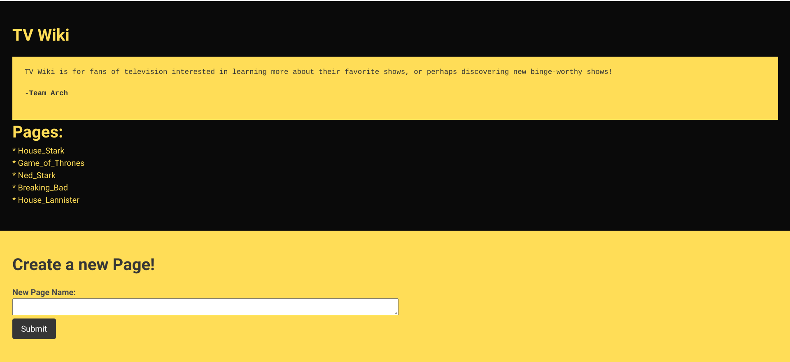
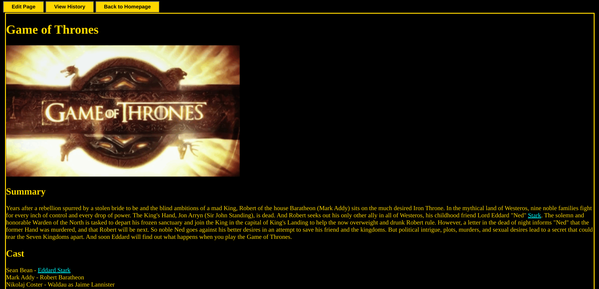
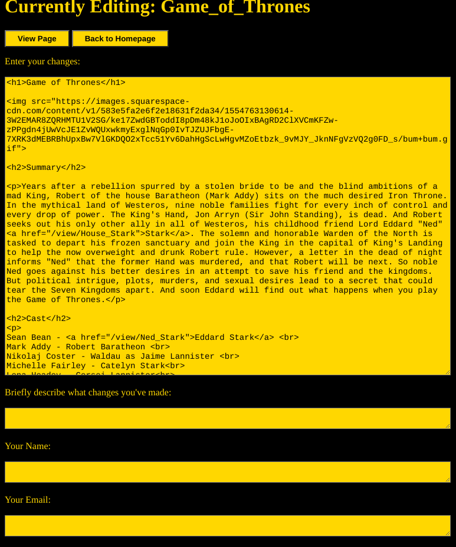
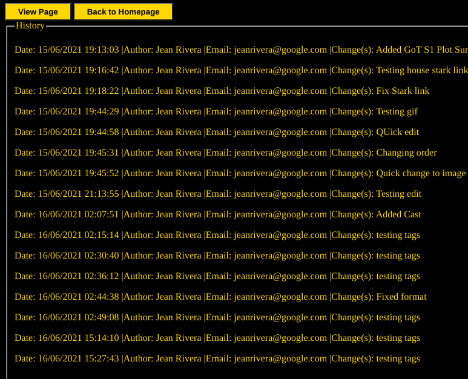

# Wiki - Built with Python and Flask

A wiki server that uses text files on the local filesystem to store page data. A location where anybody can look up and contribute known information about a television show they are interested in.

## Screenshots







## Installation

This project has been tested with Python 3.7.3. To install the necessary dependencies, first create and activate a virtual environment.

```
# Create a directory to store virtual environments.
mkdir "$HOME/venvs"

# Create the virtual environment.
python3 -m venv "$HOME/venvs/dev"

# Activate the virtual environment.
# This must be done every time you open a terminal.
# You may want to add this to your .bashrc file.
source "$HOME/venvs/dev/bin/activate"
```

Install the necessary dependencies with pip.

```
pip install -r requirements.txt
```

## Usage

Run the web server.

```
./run-flask.sh
```

Access the wiki by opening a web preview browser tab on port 8080.

## License

Apache 2.0, see [LICENSE.txt](LICENSE.txt).
